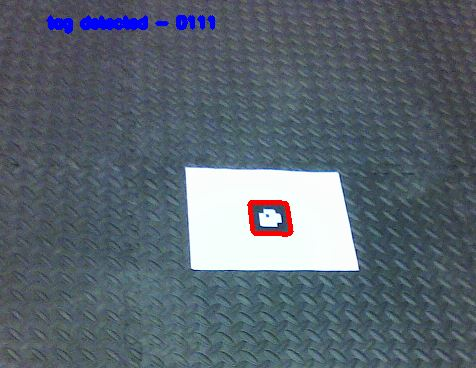
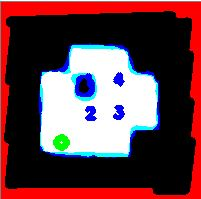
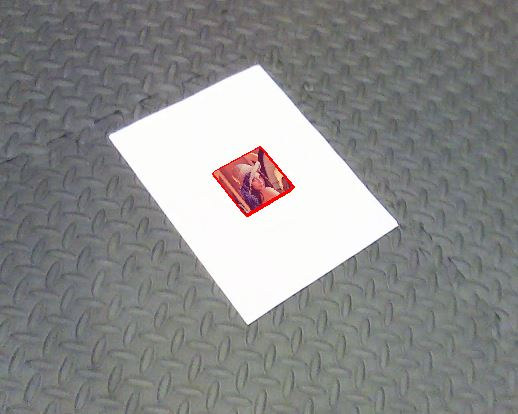
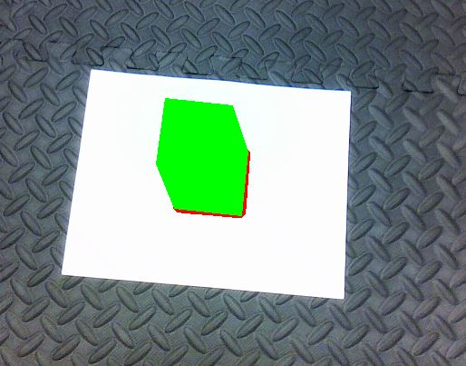

## AR Tag Detection, Decoding and Imposition

The first part of the project involves detecting and decoding the AR tag code. The second part of the project involves imposing an 2-D image and 2-D cube onto the AR tag.

# Dependencies: 
Pytho3 

OpenCV-Python

Numpy

# AR tag:


# AR tag grid:


# Detection: 
Involves finding the outer corners of the AR tag from a video.
# Decoding:
Involves finding the AR code based on inner 2x2 grid of the AR tag.

# Imposing:
Involves superimposing Lena image and a virual 3-D cube onto the AR tag.


# Steps for finding the AR tag id:
```
cd code
python3 detection.py
```
# Sample output for AR tag detection:
Output shown in the video frame:

<a href="https://imgflip.com/gif/3qf8dw"></a>

<a href="https://imgflip.com/gif/3qf8ig"></a>

<a href="https://imgflip.com/gif/3qf8mv"></a>



Output shown in the AR tag with respect to orientation:



# Steps for superimposing Lena image onto the AR tag
```
cd code
python3 imposing.py
```
# Sample output:



<a href="https://imgflip.com/gif/3qf5ez"></a>

<a href="https://imgflip.com/gif/3qf5wq"></a>

<a href="https://imgflip.com/gif/3qf602"></a>

# Steps for superimposing virtual 3-D onto the AR tag
```
cd code
python3 virtual_cube_projection.py
```
# Sample output:


<a href="https://imgflip.com/gif/3qf6dl"></a>

<a href="https://imgflip.com/gif/3qf6h0"></a>

<a href="https://imgflip.com/gif/3qf6j8"></a>

